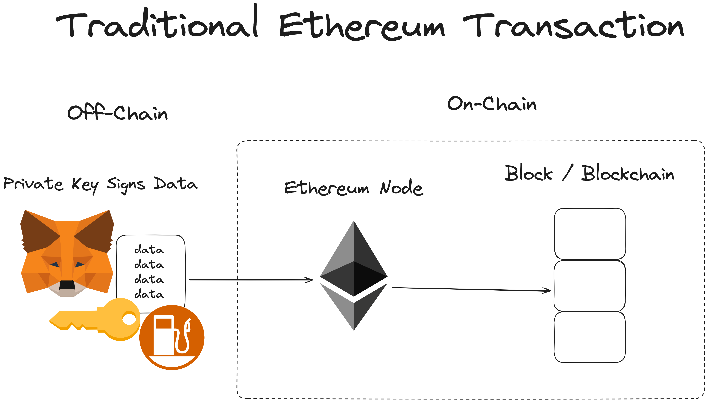
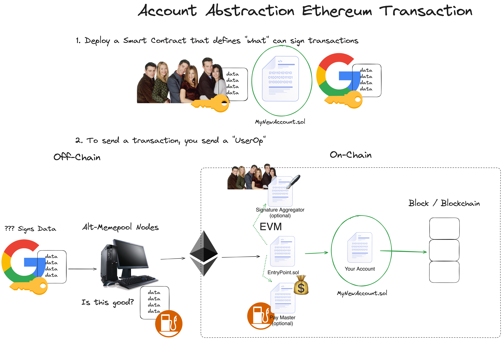

# ACCOUNT ABSTRACTION
Traditionally we have to sign the transaction only with our private key or seed phrase 
But using the account abstraction we can sign the transaction using anything like google acc ,instagram acc ,twitter acc ,email ,phone number ,only during the day or adding limits etc

Account abstraction working 
1. Ethereum : `EntryPoint.sol`
2. zkSync : Native 

Using Account Abstraction in Ethereum transactions
1. Deploy a smart contract that defines what can sign transactions(eg google session token, biometrics, etc) this will be the new wallet i.e smart contract wallet

2. To send a transaction user will send a `UserOp` to `AltMempool` which sends this transaction to ethereum node and pays the gas fee

For zkSync chain all the zkSync Nodes also acts as `AltMemPool` So we can skip sending the transaction to another `AltMemPool`

